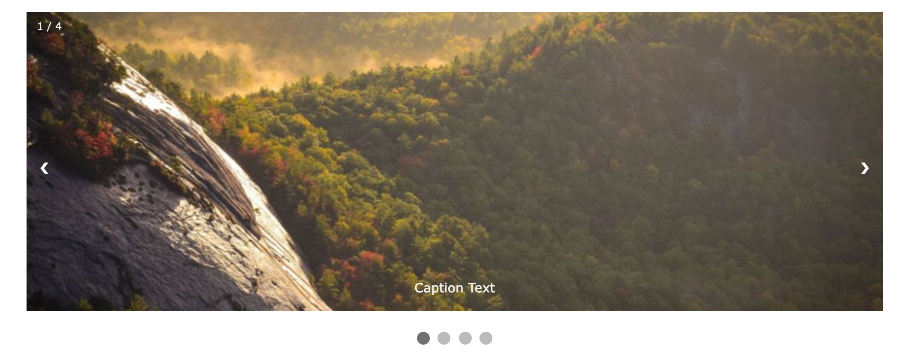

Le terme "lightbox" désigne l'affichage de médias dans une fenêtre modale. Cette méthode est souvent utilisée pour offrir une navigation dans une galerie d'images.

Le nom **Lightbox JS** provient d'une librairie JavaScript open-source développée vers 2005 par Lokesh Dhakar (puis réécrit en 2012 en utilisant jQuery). Le terme est désormais utilisé pour désigner les nobreuses librairies JavaScript produisant des effets similaires.

Quelques librairies produisant ce type d'effet:

- [Lightbox2](https://lokeshdhakar.com/projects/lightbox2/) - l'orignal, par Lokesh Dhakar. Licence MIT. Dernier release: 2020.
- [PhotoSwipe](https://photoswipe.com/), par Dmitry Semenov. Licence MIT. N'utilise pas jQuery (pur JS). Dernier release V4 en 2019, développement V5 actif en 2021.
- [Fancybox](http://fancyapps.com/fancybox/3/) Utilise jQuery. Payant pour les usages commerciaux.
- [Featherlight](https://noelboss.github.io/featherlight/), par Noël Bossart. Utilise jQuery. Licence MIT.

Librairies anciennes:

- [Magnific Popup](https://dimsemenov.com/plugins/magnific-popup/), par Dmitry Semenov. Dernier release: 2016.
- [Colorbox](http://www.jacklmoore.com/colorbox/), par Jack Moore. Utilise jQuery. Dernier release: 2016.
- Slimbox - vieux et non-maintenu, ne pas utiliser.
- Thickbox - vieux et non-maintenu, ne pas utiliser.

Voir aussi:

- [Un exemple sur W3Schools](https://www.w3schools.com/howto/howto_js_lightbox.asp)
- Le site CSS Script présente [de nombreuses librairies](https://www.cssscript.com/tag/lightbox/).
- Un [tutoriel pour créer une lightbox](https://medium.com/@diegovogel/create-a-lightbox-gallery-with-standard-bootstrap-components-b9de322ddb9e) avec les composants standard de Bootstrap.

## Swipers, Sliders, Slideshows et carousels

Une autre manière de présenter une gallerie d'images, sans ouverture de fenêtre modale, est le concept du "slideshow" ou "carousel". 

Exemples:

- [Code pour Slideshow / Carousel](https://www.w3schools.com/howto/howto_js_slideshow.asp) sur W3Schools
- [Un exemple codepen](https://codepen.io/dfitzy/pen/xZqGVo) par David Fitas
- [Un exemple codepen](https://codepen.io/AMKohn/pen/EKJHf) en pur CSS (sans JS) par Avi Kohn

Librairies complètes:

- [TinySwiper](https://tiny-swiper.js.org/docs/demo/). Taille JS: 16 Ko.
- [Splide JS](https://splidejs.com/) par Naotoshi Fujita. Taille JS: 45 Ko.
- [Flickity](https://flickity.metafizzy.co) par Metafizzy (2015-2021). Taille JS: 61 Ko. Utilisé sur [hack.eracom.ch](https://hack.eracom.ch/)
- [Swiper](https://swiperjs.com/) par Vladimir Kharlampidi (2014-2021). Taille JS: 139 Ko.
