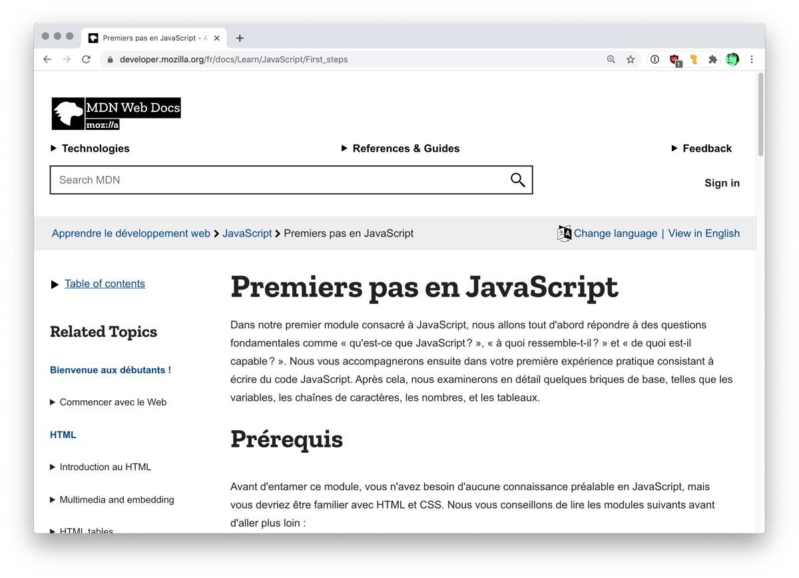

## Ressources pour apprendre

Voici des ressources pour vous permettre d'approfondir vos connaissances en JavaScript.

### Cours en ligne

#### Cours de Khan Academy

Le célèbre site [Khan Academy](https://fr.khanacademy.org/) propose plusieurs modules pour l'aprentissage de JavaScript. Les vidéos sont en anglais, avec transcription en français.

- [Introduction à JS : dessiner et animer](https://fr.khanacademy.org/computing/computer-programming/programming) - ce cours passe en revue les notions fondamentales de la programmation, telles que les variables, fonctions et boucles.
- [HTML/JS : faire des pages Web interactives](https://fr.khanacademy.org/computing/computer-programming/html-css-js) - l'objectif de ce cours est davantage centré sur l'interaction dans une page web.
- [JS avancé : jeux et rendus visuels](https://fr.khanacademy.org/computing/computer-programming/programming-games-visualizations)

#### Autres cours intéressants

- Sur OpenClassrooms: *[Apprenez à programmer avec JavaScript](https://openclassrooms.com/fr/courses/6175841-apprenez-a-programmer-avec-javascript)*, 15 heures, par Will Alexander.
- Sur Grafikart.fr, *[Apprendre le JavaScript](https://grafikart.fr/formations/debuter-javascript)*, 15h de vidéo en 29 chapitres.
- Sur Edx.org: [JavaScript Introduction](https://www.edx.org/course/javascript-introduction-2) (en anglais), par Michel Buffa, Université Côte d’Azur.

### Fonctionnement général du JavaScript:

Le site MDN Web Docs (de Mozilla) propose plusieurs tutoriels JavaScript:

- Un bon tutoriel pour débuter: *[Les bases de JavaScript](https://developer.mozilla.org/fr/docs/Learn/Getting_started_with_the_web/JavaScript_basics)*
- Un autre tutoriel plus dense: *[Une ré-introduction à JavaScript](https://developer.mozilla.org/fr/docs/Web/JavaScript/Une_réintroduction_à_JavaScript)*, MDN Web Docs.
- [Page MDN listant les ressources JavaScript](https://developer.mozilla.org/fr/docs/Web/JavaScript)

Conseils d'apprentissage par des pros:

- Conseils d'apprentissage, par Remkus de Vries: *[Learning JavaScript in WordPress, Deeply](https://remkusdevries.com/learning-javascript-in-wordpress-deeply/)* (2015).
- Deux livres [recommandés par Tom McFarlin](https://tommcfarlin.com/recommended-javascript-books/): *Head First JavaScript* (un livre d'introduction), et *JavaScript: The Good Parts* par Douglas Crockford (un livre plus avancé).

### Livres papier

Des livres papier qui peuvent être utile:

- *[JavaScript pour les web designers](https://www.eyrolles.com/Informatique/Livre/javascript-pour-les-web-designers-9782212674088/)* (2017), Mat Marquis, collection A Book Apart. Un petit livre qui donne une bonne introduction.
- *[Tout JavaScript](https://www.toutjavascript.com/)* (2020, 2e édition), Olivier Hondermarck, Editions Dunod. Réécriture d'un livre paru 10 ans auparavant.